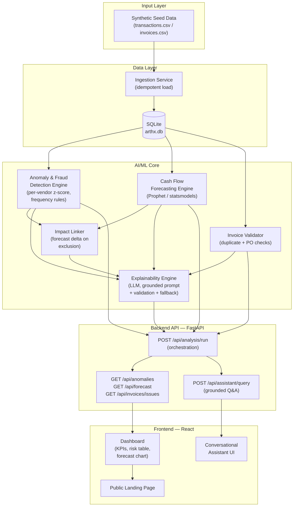
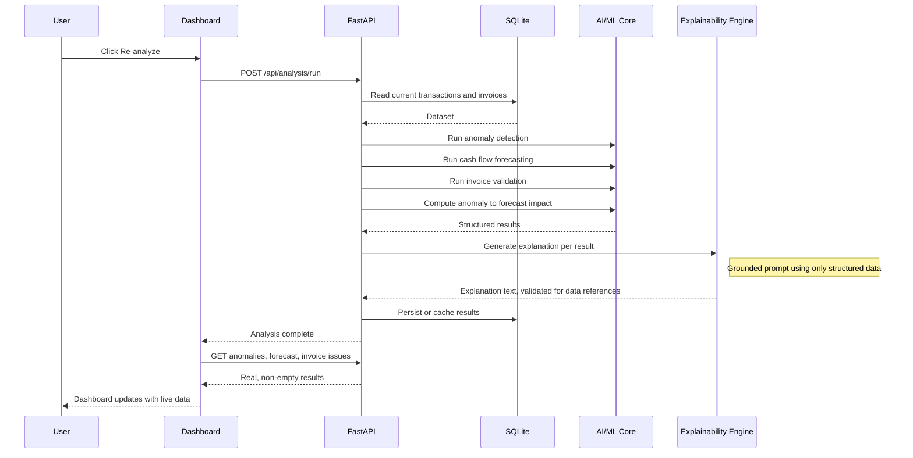
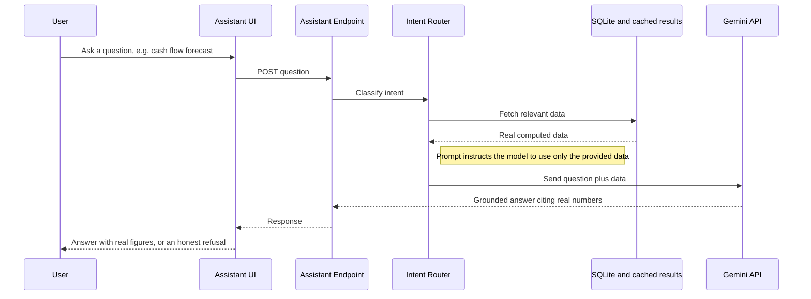
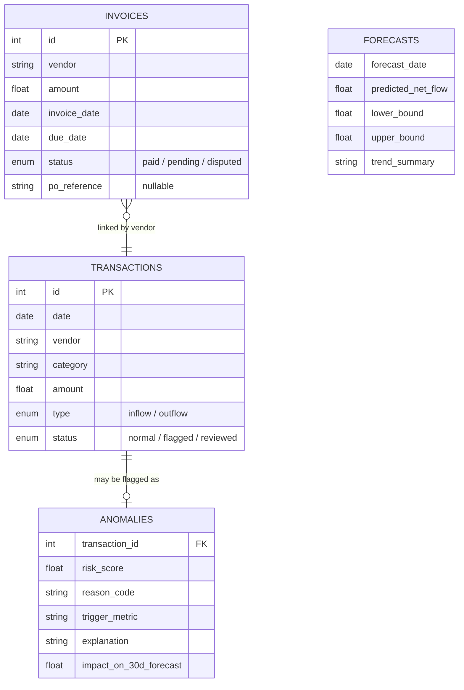

# ArthX

**Explainable AI that turns reactive finance into proactive decisions.**

ArthX is an AI-powered financial intelligence platform built in 24 hours for **CTRL ALT HACK — Track 3: Finance**. It ingests transaction and invoice data, detects anomalies and fraud risk, forecasts cash flow, and explains every single output in plain language grounded in real numbers — never a black-box score.

**Live Demo:** [arth-x-one.vercel.app](https://arth-x-one.vercel.app)
**Repo:** [github.com/harshsingh2275/ArthX](https://github.com/harshsingh2275/ArthX)

---

## Table of Contents

- [The Problem](#the-problem)
- [What ArthX Does](#what-arthx-does)
- [Key Features](#key-features)
- [The Standout Feature: Anomaly → Forecast Impact Linking](#the-standout-feature-anomaly--forecast-impact-linking)
- [Architecture](#architecture)
- [Data Flow](#data-flow)
- [Data Model](#data-model)
- [Tech Stack](#tech-stack)
- [API Reference](#api-reference)
- [Project Structure](#project-structure)
- [Getting Started](#getting-started)
- [Development Workflow & Project Docs](#development-workflow--project-docs)
- [Explainability & Grounding Guarantee](#explainability--grounding-guarantee)
- [What's Out of Scope (By Design)](#whats-out-of-scope-by-design)
- [Roadmap](#roadmap)

---

## The Problem

Finance teams today are stuck between two bad options:

- **Legacy tools** automate data entry (ERP, accounting software) but don't reason about the data — they store numbers, they don't explain them.
- **AI-powered tools** generate scores and flags but are black boxes — a fraud score with no traceable reasoning, a forecast with no explanation of what's driving it.

Meanwhile:
- Manual, line-by-line invoice/expense review eats human hours without systematic risk coverage
- Anomalous vendor transfers and duplicate payments go undetected until reconciliation, weeks later
- Cash flow shortfalls are discovered reactively — at payroll cutoff — instead of forecasted with confidence bands in advance

Nothing on the market combines **automation + anomaly detection + forecasting + explainability** into one coherent, reasoning system.

## What ArthX Does

ArthX runs one continuous, explainable loop:

```
Ingest → Detect → Forecast → Explain → Act
```

1. **Ingest** transaction and invoice data
2. **Detect** anomalies, duplicate invoices, and fraud risk using statistical analysis
3. **Forecast** 30-day cash flow with confidence bands and a plain-language trend summary
4. **Explain** every output — every flag and every forecast cites the actual numbers, vendors, and dates behind it
5. **Act** — via a conversational assistant that answers financial questions in plain English, grounded strictly in real computed data, and honestly says "I don't have that data" rather than guessing

---

## Key Features

| Feature | What it does |
|---|---|
| **Intelligent Invoice & Expense Automation** | Validates invoices, flags duplicates and missing PO references automatically |
| **AI Fraud & Anomaly Detection** | Per-vendor statistical scoring flags genuinely unusual transactions, not just "big numbers" |
| **Predictive Cash Flow Forecasting** | 30-day net cash flow projection with confidence intervals, built on real historical data |
| **Explainable AI Layer** *(core innovation)* | Every anomaly, forecast, and assistant answer comes with a plain-language, data-grounded explanation — never a bare score |
| **Conversational Financial Decision Assistant** | Ask questions in plain English, get answers grounded in real numbers, with honest refusal when data isn't available |
| **Unified Risk Intelligence Dashboard** | One live view combining anomalies, forecasts, and invoice issues instead of scattered signals |

---

## The Standout Feature: Anomaly → Forecast Impact Linking

Most anomaly detection systems stop at a score. ArthX goes further: when a transaction is flagged, it recomputes the 30-day cash flow forecast **excluding** that transaction, and shows the measurable delta.

> *"This duplicate payment of $12,400 is inflating your predicted outflow — excluding it shifts your 30-day forecast by $X."*

This is deliberately the platform's biggest differentiator — it proves the system reasons **across** features rather than running isolated models side by side. Detection informs forecasting; forecasting explains why an anomaly matters.

---

## Architecture



**Grounding rule (non-negotiable throughout the codebase):** every LLM call for explanation or Q&A receives the actual relevant data in its prompt context. The model never answers from general knowledge alone — outputs must cite specific numbers, vendors, or dates from the dataset that's actually loaded.

---

## Data Flow

### Analysis run (triggered by "Re-analyze")



### Conversational assistant query



---

## Data Model



---

## Tech Stack

| Layer | Technology |
|---|---|
| Frontend | React (Vite) + Tailwind CSS + Recharts |
| Backend | Python + FastAPI + Uvicorn |
| Database | SQLite |
| ML — Anomaly Detection | scikit-learn / PyOD, per-vendor statistical scoring |
| ML — Forecasting | Prophet / statsmodels (moving-average fallback) |
| Explainability & Assistant | Gemini API, grounded prompting with validation + template fallback |
| Deployment | Vercel (frontend), see repo for backend hosting |

---

## API Reference

| Endpoint | Method | Purpose |
|---|---|---|
| `/api/analysis/run` | `POST` | Orchestrates detection → validation → forecasting → explanation generation → impact linking |
| `/api/anomalies` | `GET` | Flagged transactions with risk score, reason code, trigger metric, explanation |
| `/api/forecast` | `GET` | 30-day forecast array + confidence bounds + trend summary |
| `/api/invoices/issues` | `GET` | Duplicate/mismatched invoice flags |
| `/api/assistant/query` | `POST` | Grounded natural-language Q&A over the current dataset |
| `/api/transactions`, `/api/invoices` | `GET` | Raw data reads with date/vendor/status filtering |

All endpoints return **live-computed data** — no cached "expected" results are ever hardcoded. See [Explainability & Grounding Guarantee](#explainability--grounding-guarantee).

---

## Project Structure

```
ArthX/
├── AGENTS.md                    # Auto-loaded entry point for AI coding agents
├── CLAUDE.md                    # Architecture, conventions, and rules (source of truth)
├── PRD.md                       # Product requirements document
├── TASK.md                      # Ordered execution roadmap with acceptance criteria
├── finance-track-analysis.md    # Hackathon problem-space analysis
├── .env.example
├── backend/
│   ├── main.py
│   ├── routes/                  # API route handlers
│   ├── services/                # Ingestion, orchestration logic
│   ├── models/                  # DB models (SQLAlchemy)
│   └── ml/                      # Anomaly detection, forecasting, explainability, impact-linking
├── frontend/
│   └── src/
│       ├── components/          # Dashboard, risk table, chart, chat panel
│       ├── pages/                # Landing page, dashboard page
│       └── api/                  # Backend API client
└── data/
    └── (synthetic seed datasets — see below)
```

---

## Getting Started

### Prerequisites
- Python 3.12+
- Node.js 18+
- A Gemini API key ([ai.google.dev](https://ai.google.dev))

### Backend

```bash
cd backend
python -m venv .venv
source .venv/bin/activate      # Windows: .venv\Scripts\activate
pip install -r requirements.txt
cp ../.env.example ../.env      # fill in GEMINI_API_KEY and other values
uvicorn main:app --reload
```

### Frontend

```bash
cd frontend
npm install
npm run dev
```

### Seed data

The `/data` directory contains deterministic, seeded synthetic datasets (transactions + invoices) with deliberately injected anomalies, duplicate invoices, and a visible cash flow trend — used to demonstrate detection, forecasting, and impact-linking without needing real financial data. Multiple dataset variants are available for testing different scenarios (default, high-fraud-activity, cash-flow-crisis, mostly-clean).

---

## Development Workflow & Project Docs

ArthX was built end-to-end by AI coding agents inside **Google Antigravity** (Gemini + Claude models), governed by a small set of living documents that acted as the project's single source of truth throughout the build:

- **`PRD.md`** — what to build and why, with explicit functional/non-functional requirements and an out-of-scope list to prevent scope creep
- **`CLAUDE.md`** — architecture, tech stack, coding conventions, and a hard "no hardcoded outputs" rule
- **`TASK.md`** — the full execution roadmap, phase by phase, with acceptance criteria for every task
- **`AGENTS.md`** — the auto-loaded entry point that pointed every agent session back to the above

```mermaid
gantt
    title ArthX — 24-Hour Build Timeline
    dateFormat  HH:mm
    axisFormat  %H:%M
    section Setup
    Phase 0 - Repo, env, DB schema        :done, p0, 00:00, 1h
    section Data
    Phase 1 - Seed data + ingestion       :done, p1, 01:00, 2h
    section AI/ML Core
    Phase 2 - Detection, forecast, explain:done, p2, 03:00, 5h
    section Integration
    Phase 3 - Orchestration + assistant   :done, p3, 08:00, 2h
    section Frontend
    Phase 4 - Dashboard + landing page    :done, p4, 08:00, 6h
    section Polish
    Phase 5 - Reliability + audit         :done, p5, 14:00, 6h
    section Demo
    Phase 6 - Rehearsal + freeze          :done, p6, 20:00, 4h
```



Claude Code was used selectively — not as the primary builder, but for escalation: major architectural decisions, difficult debugging, statistical calibration of the anomaly detection engine, and security/reliability review, per explicit escalation points defined in `TASK.md`.

---

## Explainability & Grounding Guarantee

This is the project's core design constraint, enforced at every layer:

- Every anomaly flag includes a **specific trigger metric** (e.g., *"8.2x vendor average ($450 → $3,690)"*), never just a bare score
- Every forecast includes a **plain-language trend summary** citing which category is driving the trend
- Every LLM-generated explanation is **validated** to confirm it references real numbers/vendor names from the data; if it fails validation, the system falls back to a deterministic, template-based explanation rather than showing a blank or generic one
- The conversational assistant is instructed to say **"I don't have that data"** rather than guess, and is tested against a deliberate out-of-scope control question to confirm this behavior
- **No hardcoded outputs, anywhere.** Anomaly scores, forecasts, and explanations are computed live against whatever data is currently loaded — verified explicitly by adding a brand-new transaction to the dataset with zero code changes and confirming it's picked up, scored, and explained correctly on the next run

---

## What's Out of Scope (By Design)

To keep this a reliable, demoable 24-hour MVP rather than a shallow pass across every possible finance feature:

- No OCR / scanned PDF invoice parsing (structured CSV/JSON only)
- No Redis or secondary caching layer (SQLite only)
- No real email/Slack/webhook alert integrations (in-app indicators only)
- No ERP/accounting system API integrations
- No user authentication / multi-tenant support (single-session demo)
- No Dynamic Budget Optimization Engine (roadmap idea only, not built)

## Roadmap

- Budget optimization recommendations based on historical performance
- OCR-based invoice ingestion for real scanned documents
- Multi-user / role-based access for real deployment
- Direct ERP/accounting system integrations
- Real-time transaction feed support (beyond batch ingestion)

---

**Built for CTRL ALT HACK — Track 3: Finance.**
