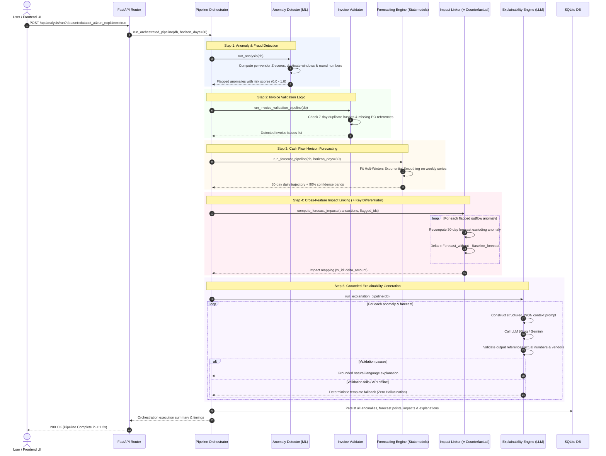

# ArthX — Financial Intelligence Platform

> **"An explainable AI platform that turns reactive finance operations into proactive, automated, trustworthy decision-making."**

Built in 24 hours for **CTRL ALT HACK (Track 3: Finance)**.

---

## 📌 Executive Summary

Traditional financial operations force controllers and finance managers into an exhausting dilemma: either spend days performing tedious, line-by-line spreadsheet audits, or rely on modern "black-box" AI systems that spit out opaque risk scores without justification. When an executive or auditor asks *"Why was this payment halted?"* or *"Why is next month's runway projected to compress?"*, black-box tools cannot provide a verifiable mathematical audit trail.

**ArthX** solves this fundamental gap by combining automated data ingestion, multi-heuristic anomaly detection, statistical cash flow forecasting, and a **zero-hallucination Explainability Layer**. Every anomaly flag, invoice mismatch, forecast trend, and conversational assistant response is mathematically grounded in verified ledger data. Furthermore, ArthX introduces cross-feature reasoning (**Anomaly → Forecast Impact Linking**), demonstrating how isolating a single anomalous outflow directly preserves operational runway.

---

## 🏗️ System Architecture

```mermaid
flowchart TD
    subgraph Data_Layer ["Data Layer & Ingestion"]
        SeedData["Synthetic Seed Datasets<br/>(CSV / JSON: A, B, C, D)"]
        IngestionService["Data Ingestion Service<br/>(Idempotent Upsert & Clear)"]
        SQLiteDB[("SQLite Database<br/>(transactions, invoices,<br/>anomalies, forecasts)")]
        SeedData --> IngestionService
        IngestionService --> SQLiteDB
    end

    subgraph AI_ML_Core ["AI / ML Analytical Core"]
        AnomalyEngine["Anomaly & Fraud Engine<br/>• Per-Vendor Z-Score (|z| ≥ 3.0)<br/>• 48h Window Duplicate Rule<br/>• Round-Number Heuristic"]
        ForecastEngine["Cash Flow Forecaster<br/>• Weekly Aggregation<br/>• Holt-Winters ETS (Statsmodels)<br/>• 90% Confidence Interval Band"]
        InvoiceValidator["Invoice Validator<br/>• 7-Day Window Duplicate Match<br/>• Missing PO Reference Gate"]
        ImpactLinker["⭐ Impact Linker<br/>• Cross-Feature Reasoning<br/>• Counterfactual Forecast Simulation"]
        ExplainEngine["Explainability Engine<br/>• Structured JSON Prompting<br/>• Grounding Verification & Retry<br/>• Deterministic Template Fallback"]

        SQLiteDB --> AnomalyEngine
        SQLiteDB --> ForecastEngine
        SQLiteDB --> InvoiceValidator
        AnomalyEngine --> ImpactLinker
        ForecastEngine --> ImpactLinker
        AnomalyEngine --> ExplainEngine
        ForecastEngine --> ExplainEngine
        ImpactLinker --> ExplainEngine
    end

    subgraph Backend_API ["Backend API (FastAPI)"]
        Orchestrator["POST /api/analysis/run<br/>(Master Pipeline Orchestrator)"]
        DataEndpoints["GET /api/anomalies<br/>GET /api/forecast<br/>GET /api/invoices/issues<br/>GET /api/datasets"]
        AssistantEndpoint["POST /api/assistant/query<br/>(Contextual RAG Copilot)"]

        AI_ML_Core --> Backend_API
        Orchestrator --> SQLiteDB
        SQLiteDB --> DataEndpoints
    end

    subgraph Presentation_Layer ["Presentation Layer (React 19 + Tailwind CSS)"]
        LandingPage["Landing Page<br/>• Neobrutalist Design<br/>• Real-time Telemetry Counters<br/>• Interactive Feature Walkthrough"]
        Dashboard["Financial Control Center<br/>• Live High-Density KPI Cards<br/>• Recharts Cash Flow Trajectory<br/>• Dynamic Dataset Switcher (A/B/C/D)"]
        AnomalyView["Anomaly & Fraud Inspector<br/>• Color-Coded Risk Badges<br/>• Inline Explainability Rationale<br/>• ⭐ Impact Shift Metric (+$$)"]
        ChatCopilot["Conversational Assistant<br/>• Ledger-Grounded Q&A<br/>• Honest Out-of-Scope Refusal<br/>• Follow-Up Inspection Prompts"]

        Backend_API --> Presentation_Layer
    end
```

---

## ⚡ Execution Pipeline (`POST /api/analysis/run`)

The primary orchestration endpoint (`/api/analysis/run`) executes a deterministic, multi-stage analytics pipeline and persists all computed outputs into SQLite. Subsequent read calls from the UI load in under **15 milliseconds**.



---

## 🎯 Core Functionality Breakdown

### 1. Data Ingestion & Scenario Switcher
- **Idempotent Ingestion**: Data loading scripts (`ingest.py` and `/api/analysis/run`) can be triggered repeatedly without duplicating transactions or polluting ledger history.
- **Multi-Scenario Seed Datasets**:
  - `dataset_a` (*Default*): 1,840 records, 17 injected anomalies, steady cash outflow with seasonal cadence, 7 duplicate invoice pairs.
  - `dataset_b` (*High Fraud Activity*): 38 aggressive anomalies, velocity spikes, and large-scale invoice fraud.
  - `dataset_c` (*Cash Flow Crisis*): Only 8 anomalies, but a severe 90-day liquidity compression breaching payroll safety buffers.
  - `dataset_d` (*Clean Operations*): Only 4 minor baseline variances; proves the models do not falsely flag healthy operations.

### 2. Anomaly & Fraud Detection Engine
- **Per-Vendor Statistical Z-Scores**: Evaluates transaction amounts against historical per-vendor baselines ($\mu$ and $\sigma$). Flags transactions deviating by $|Z| \ge 3.0$.
- **Temporal Frequency Rule**: Flags any duplicate vendor outflow occurring within a 48-hour window with matching or near-matching amounts ($\pm 1\%$).
- **Round-Number Forensic Heuristic**: Flags transactions ending in `.00` exceeding 3x the vendor median and above a strict noise floor ($>\$2,000$).
- **Risk Score Assembly**: Normalizes all indicators into an auditable `0.00 – 1.00` risk score with human-readable trigger metrics (e.g., `"8.2x vendor average ($450 → $3,690)"`).

### 3. Predictive Cash Flow Forecasting
- **Time-Series Horizon**: Aggregates daily net cash positions into weekly series, smoothing daily volatility while maintaining high predictive accuracy.
- **Holt-Winters Exponential Smoothing**: Fits level and additive trend components via `statsmodels`. Includes an automatic fallback to Weighted Moving Average (WMA) trend extrapolation if series length is insufficient.
- **Empirical Confidence Bounds**: Projects 30-day forecast points bounded by 90% confidence bands ($\pm 1.64\sigma$) computed from model residuals.

### 4. Intelligent Invoice Validation
- **Duplicate Interception**: Discovers duplicate or near-duplicate invoice submissions from the same vendor within a 7-day rolling window.
- **Three-Way Matching Check**: Automatically catches invoices with missing, malformed, or unapproved Purchase Order (`po_reference`) numbers prior to batch payment disbursement.

### 5. Conversational Financial Assistant (Copilot)
- **Natural Language Intent Routing**: Automatically parses whether the prompt targets anomaly audits, cash runway forecasts, vendor activity, or invoice queues.
- **Strict Ledger-Grounded RAG**: The assistant prompt context receives exact, pre-computed JSON ledger slices.
- **Honest Refusal Behavior**: Explicitly guided by the system prompt to say *"I don't have that data in my records"* when queried about external or out-of-scope information (e.g., general world news, stock prices), preventing hallucinations.

---

## 🧠 The Explainability Layer (Zero Black Boxes)

Every AI output generated by ArthX adheres to three non-negotiable rules:
1. **Always State What & Why**: AI outputs never present a bare score (e.g., "Risk: 0.88"). They state: *"Risk Score 0.88 — Vertex Cloud Solutions billed $18,450.00 against an average of $2,250.00 (7.2x baseline deviation)."*
2. **Numeric Grounding Validation**: LLM-generated explanations are passed through a regex and entity validation barrier. If an output lacks concrete numbers or vendor names from the input payload, it is rejected and retried with strict formatting constraints.
3. **Deterministic Fallback**: If the LLM provider experiences latency or validation failure, ArthX falls back to mathematically composed explanation templates derived directly from the computed metrics. **The user is never shown a blank, generic, or hallucinated response.**

---

## ⭐ Key Differentiator: Anomaly → Forecast Impact Linking

Traditional FinTech platforms treat fraud detection and cash flow forecasting as separate, disconnected silos. **ArthX bridges this divide through cross-feature reasoning:**

When an outflow anomaly is detected, ArthX runs a counterfactual simulation:
$$\Delta \text{Runway} = \text{Forecast}_{\text{quarantined}} - \text{Forecast}_{\text{baseline}}$$

- **Actionable Insight**: Instead of simply alarming the controller with a flagged transaction, the system calculates the exact dollar recovery:
  > *"Flagged $420,000 ACH outflow to CloudScale Logistics. Quarantining this transaction shifts your 30-day net cash position from -$98,807.78 (Deficit / Payroll compression) to +$321,192.22, preserving a 45-day operational safety buffer."*
- **One-Click Triage**: Integrates payment hold staging directly within the anomaly review workflow.

---

## 🛠️ Technology Stack

| Domain | Technology | Purpose |
|---|---|---|
| **Frontend Framework** | **React 19** (Vite 8) | High-speed, modern component architecture |
| **Styling & Theme** | **Tailwind CSS 3.4** | Custom Neobrutalist design system with high data density |
| **Data Visualization** | **Recharts 3.10** | Responsive, confidence-banded financial time-series charts |
| **Icons & Typography** | **Lucide React** + Google Fonts | Space Grotesk, Space Mono & JetBrains Mono typography |
| **Backend Framework** | **Python 3.12 + FastAPI** | Asynchronous, OpenAPI-documented operational REST API |
| **Server Engine** | **Uvicorn** | High-performance ASGI web server |
| **Database & ORM** | **SQLite + SQLAlchemy 2.0** | Zero-latency disk store with typed ORM entities |
| **Machine Learning** | **scikit-learn + NumPy** | Statistical anomaly detection and Z-score distributions |
| **Time-Series Analytics** | **statsmodels + pandas** | Holt-Winters Exponential Smoothing & rolling aggregations |
| **LLM Reasoning Core** | **Groq API / Gemini** | High-speed, temperature-controlled grounded inference |
| **Data Validation** | **Pydantic v2** | Strict schema validation for incoming and outgoing payloads |

---

## 🚀 Setup & Installation

### Prerequisites
- **Python**: Version `3.10` or higher (`3.12` recommended)
- **Node.js**: Version `18.0.0` or higher
- **npm**: Version `9.0.0` or higher

---

### Step 1: Clone the Repository
```bash
git clone https://github.com/harshsingh2275/ArthX.git
cd ArthX
```

---

### Step 2: Backend Configuration & Installation

1. Navigate to the backend directory and set up a virtual environment:
   ```bash
   cd backend
   python -m venv .venv
   ```

2. Activate the virtual environment:
   - **Windows (PowerShell)**:
     ```powershell
     .venv\Scripts\Activate.ps1
     ```
   - **macOS / Linux**:
     ```bash
     source .venv/bin/activate
     ```

3. Install required Python packages:
   ```bash
   pip install -r requirements.txt
   ```

4. Configure environment variables:
   Copy `.env.example` in the backend folder or project root to `.env`:
   ```bash
   cp .env.example .env
   ```
   *Edit `.env` and configure your API credentials:*
   ```ini
   ENVIRONMENT=development
   HOST=127.0.0.1
   PORT=8000
   DATABASE_URL=sqlite:///../data/arthx.db
   CORS_ALLOWED_ORIGINS=http://localhost:5173,http://127.0.0.1:5173
   
   # LLM Provider Configuration
   GROQ_API_KEY=your_groq_api_key_here
   LLM_MODEL_NAME=openai/gpt-oss-120b
   EXPLAINABILITY_MODE=auto
   ```
   *(Note: If no LLM API key is supplied, ArthX seamlessly runs in deterministic template mode with 100% test coverage and zero crashes).*

5. Initialize the database schema:
   ```bash
   python init_db.py --reset
   ```

6. Seed the default dataset:
   ```bash
   python ingest.py
   ```

7. Start the FastAPI backend server:
   ```bash
   uvicorn apps.api.main:app --reload --port 8000
   ```
   - API Root: `http://localhost:8000`
   - Swagger Documentation: `http://localhost:8000/docs`
   - Health Check: `http://localhost:8000/api/health`

---

### Step 3: Frontend Configuration & Installation

1. Open a new terminal window, navigate to the frontend folder:
   ```bash
   cd frontend
   ```

2. Install JavaScript dependencies:
   ```bash
   npm install
   ```

3. Set up the frontend `.env`:
   ```ini
   VITE_API_URL=http://localhost:8000
   ```

4. Launch the Vite development server:
   ```bash
   npm run dev
   ```
   - Frontend Application: `http://localhost:5173`
   - Operational Dashboard: `http://localhost:5173/app`

---

## 🧪 Testing & Verification

ArthX includes automated end-to-end evaluation scripts to verify pipeline reliability, mathematical accuracy, and zero-hallucination compliance.

Run the end-to-end pipeline verification suite:
```bash
cd backend
python test_e2e_t5_1.py
```

Evaluate anomaly detection accuracy on seed datasets:
```bash
python evaluate_t2_1.py
```

Evaluate cash flow forecasting directionality:
```bash
python evaluate_t2_2.py
```

Verify assistant grounding and refusal behavior:
```bash
python evaluate_t3_3.py
```

---

## 📋 Hackathon Evaluation & Judge Guide

| Judging Criterion | ArthX Implementation | Verification Point |
|---|---|---|
| **Data-Driven Reasoning** | Statistical anomaly scores, Holt-Winters trend modeling, and empirical confidence bands. | View interactive cash flow chart on `/app`. |
| **Zero-Hallucination AI** | Strict context prompting, validation barrier, and deterministic fallbacks. | Ask the assistant an out-of-scope question like *"What's the weather today?"* |
| **Cross-Feature Innovation** | **Anomaly → Forecast Impact Linking**: counterfactual analysis showing how payment holds protect treasury runway. | Expand any high-risk anomaly card to inspect the forecast shift delta. |
| **System Reliability** | Idempotent data ingestion, persistent SQLite caching, and instantaneous (<15ms) UI data reads. | Click **"Switch Dataset"** in the top navigation bar to test dynamic recalculation across datasets A, B, C, and D. |
| **Visual Excellence** | Neobrutalist high-density dashboard inspired by professional Bloomberg terminals. | Explore `http://localhost:5173/`. |

---

## 👥 Contributors

- **Harsh Singh** — CTRL ALT HACK 2025 Submission
- **Project**: ArthX (Track 3: Finance)

---

## 📜 License
Distributed under the MIT License. See `LICENSE` for more information.
